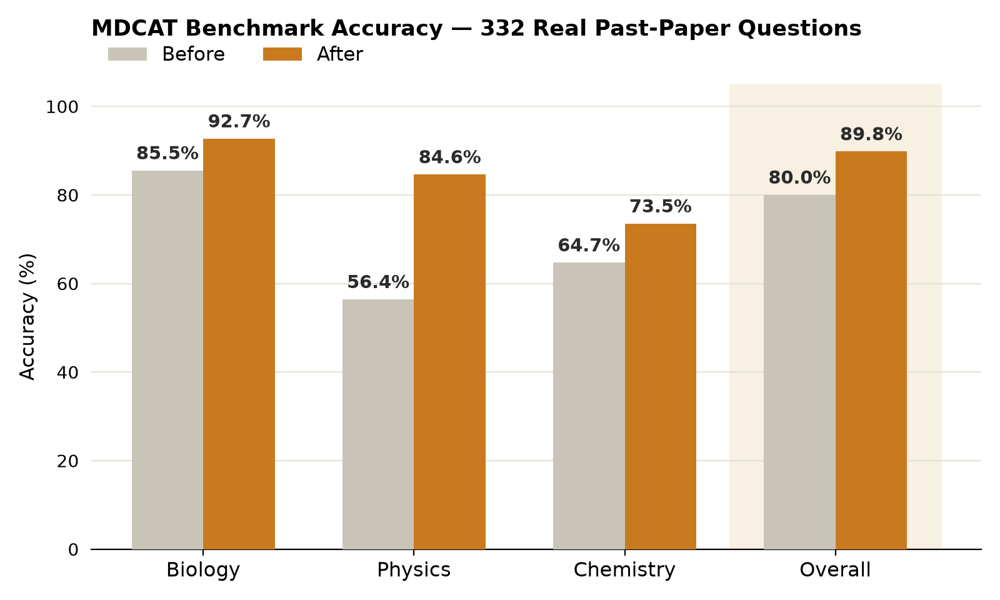
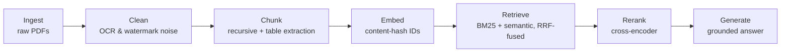

# MDCAT Copilot — Production RAG, Built From Scratch


A retrieval-augmented generation system built end-to-end — ingestion, cleaning, hybrid retrieval,
reranking, and generation — applied to MDCAT (Pakistan's medical-entrance exam) prep across
Biology, Chemistry, and Physics, and graded against a 332-question benchmark of real past-paper
questions.

**[Live demo](https://mdcat-rag-demo.streamlit.app/)** · **[Full case study](https://sulemantech.github.io/production-rag-from-scratch/)** · **[Engineering log](docs/LEARNINGS.md)**

---

## Results



| Subject | Before | After | Δ |
|---|---|---|---|
| Biology | 85.5% | 92.7% | +7.2 |
| Physics | 56.4% | 84.6% | +28.2 |
| Chemistry | 64.7% | 73.5% | +8.8 |
| **Overall** | **80.0%** | **89.8%** | **+9.8** |

Measured on the same 332-question benchmark, same corpus, one variable isolated at a time. The
single largest gain came from testing generation-model capacity directly — not another retrieval
tweak — and it was verified on the full question set, not a cherry-picked sample.

Full before/after methodology, including two experiments that were tested and **reverted** after
measuring a net-negative effect, is in the [case study](https://sulemantech.github.io/production-rag-from-scratch/)
and [engineering log](docs/LEARNINGS.md).

---

## Pipeline



No stage was assumed to be working — every one of these was independently broken, measured, fixed,
and re-measured at least once over the course of the build.

---

## The discipline behind the numbers

- **Measure the noise floor before trusting any comparison.** Every before/after result was
  re-run once on identical input (temp=0) before being trusted — a comparison that isn't
  reproducible against itself isn't a comparison yet.
- **Audit failures against actual retrieved context, not guesswork.** Every wrong answer was
  traced back to what the model actually saw, and classified before any fix was attempted.
- **Fix the source before the code.** Weak PDF extraction was solved with better source
  documents and dedicated table extraction, not more cleanup regex against unrecoverable noise.
- **Revert when the data says to.** A technically correct Chemistry fix was tested across three
  iterations, measured net-negative every time, and fully reverted rather than left in place
  because it "should" have worked.

See [docs/LEARNINGS.md](docs/LEARNINGS.md) for the full, specific write-up of each bug, root
cause, and fix — including the ones that didn't pan out.

---

## Try it

The [live demo](https://mdcat-rag-demo.streamlit.app/) runs the actual pipeline above — ask a
Biology, Chemistry, or Physics question and see the real retrieved context alongside the answer,
nothing hidden.

To run it locally:

```bash
pip install -r requirements.txt
python src/scripts/build_mdcat_chunks.py       # ingest + chunk the corpus
python src/scripts/build_mdcat_collection.py   # embed + build the vector store
python src/evaluation/evaluator.py             # run the full benchmark
```

Requires a `GROQ_API_KEY` in `.env` for generation.

---

<details>
<summary><strong>Project origin: a phase-by-phase learning roadmap</strong> (click to expand)</summary>

This project started as a hands-on learning exercise — every component built and understood
before moving to the next, not copied from a tutorial. The original phase-by-phase plan is kept
below for reference; all phases through evaluation and deployment are now complete.

### How This Worked

1. Read the task for the current phase
2. Build it yourself (look things up, experiment, break things)
3. Answer the comprehension questions before moving to the next phase
4. Only then move on

### Phase 1 — Document Ingestion
Load a document into raw text/strings. Handle `.txt` and PDF sources; strip whitespace, headers,
and footers.

### Phase 2 — Chunking
Compare fixed-size, sentence-based, and recursive chunking strategies; measure chunk count and
size distribution for each.

### Phase 3 — Embeddings
Turn a chunk of text into a vector using `sentence-transformers`; verify similarity behaves as
expected on known-similar and known-different sentence pairs.

### Phase 4 — Vector Store
Store embeddings in ChromaDB; query by similarity; confirm deterministic results across repeated
queries.

### Phase 5 — Retrieval
Build semantic (embedding) and BM25 (keyword) retrievers, then combine them with Reciprocal Rank
Fusion into a hybrid retriever.

### Phase 6 — Reranking
Add a cross-encoder second pass that re-scores retrieved chunks by true relevance to the query.

### Phase 7 — Generation
Wire retrieved context and the user's question into a prompt, and generate a grounded answer.

### Phase 8 — Evaluation
Build a golden dataset and measure Hit Rate@k and Precision@k — this phase grew into the full
332-question MDCAT benchmark documented in the Results section above.

### Phase 9 — Full Pipeline
Orchestrate ingestion → chunking → embedding → storage → retrieval → reranking → generation into
a single pipeline.

### Phase 10 — Production API / Deployment
Expose the pipeline as a usable interface — realized as the
[Streamlit live demo](https://mdcat-rag-demo.streamlit.app/) rather than a raw API.

**Status: all phases complete.** See [docs/LEARNINGS.md](docs/LEARNINGS.md) for what was actually
learned building each one.

</details>
